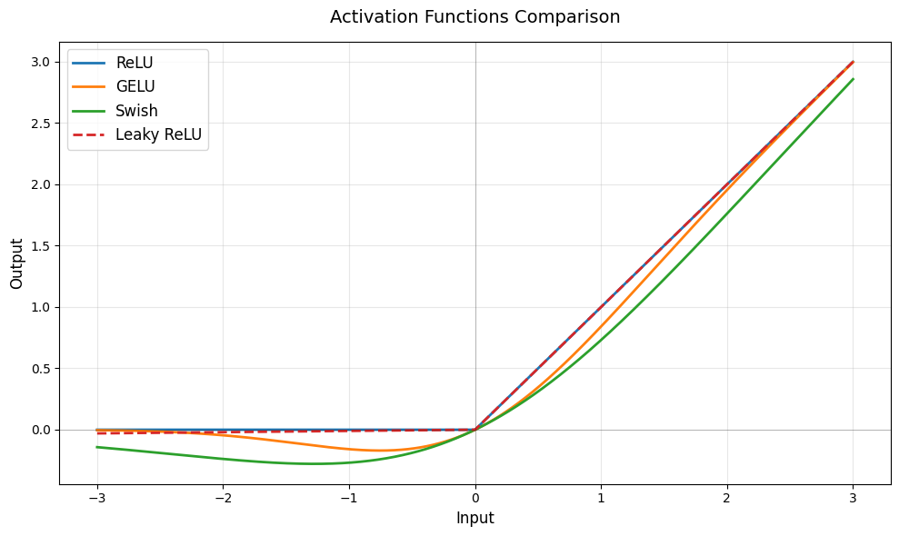

# sslides


<!-- WARNING: THIS FILE WAS AUTOGENERATED! DO NOT EDIT! -->

## Usage

### Installation

Install latest from the GitHub
[repository](https://github.com/rleyvasal/sslides):

``` sh
$ pip install git+https://github.com/rleyvasal/sslides.git
```

or from [pypi](https://pypi.org/project/sslides/)

``` sh
$ pip install sslides
```

### Documentation

Documentation can be found hosted on this GitHub
[repository](https://github.com/rleyvasal/sslides)’s
[pages](https://rleyvasal.github.io/sslides/). Additionally you can find
package manager specific guidelines on
[pypi](https://pypi.org/project/sslides/).

## How to use

1.  Import sslides functions `from sslides import sshow ssave`
2.  Create a note with `#| s` to tell sslides all markdown below are
    your slides
3.  The first note with \# header becomes the title page
4.  Create as many slides as you want with \## header - all content
    below that heading is the slide content
5.  At the end of slides show or save (standalone html)
    [`sshow()`](https://rleyvasal.github.io/sslides/slides.html#sshow)
    or
    [`ssave()`](https://rleyvasal.github.io/sslides/slides.html#ssave)

``` python
from sslides import sshow
```

If you are new to using `nbdev` here are some useful pointers to get you
started.

# Introducing sslides

## What is sslides

A tool for creating beautiful presentations from your solveit dialogs
and research. - At the end of dialog create your slides - `#| s` marks
the begining of slides - All Markdown and code cells below will be in
slides - Code and code output hidden in dialog will be hidden in the
slides - Navigate with arrow keys or hover on bottom right to see
controls

## Content Suported

- Markdown
- Bullet lists
- Latex Math
- Attachments from screenshots
- Code - highlighted by Pygments

## Latex - Content too long, scroll option

### Scaled Dot-Product Attention

The attention mechanism from “Attention is All You Need”:

$$\text{Attention}(Q, K, V) = \text{softmax}\left(\frac{QK^T}{\sqrt{d_k}}\right)V$$

Where $Q$ is queries, $K$ is keys, $V$ is values, and $d_k$ is the
dimension of the keys.

## Math Examples

Inline math: The quadratic formula is
$x = \frac{-b \pm \sqrt{b^2-4ac}}{2a}$

Display math: $$\int_a^b f(x)dx = F(b) - F(a)$$

Statistics: $$\bar{x} = \frac{1}{n}\sum_{i=1}^n x_i$$

Calculus derivative: $$\frac{d}{dx}(x^n) = nx^{n-1}$$

Matrix: $$\begin{bmatrix} a & b \\ c & d \end{bmatrix}$$

## Attachments


## Plots

### Activation Functions Comparisons

- Code hidden in Solveit = Code hidden in slides

``` python
import matplotlib.pyplot as plt
import numpy as np

x = np.linspace(-3, 3, 1000)

# Activation functions
relu = np.maximum(0, x)
gelu = 0.5 * x * (1 + np.tanh(np.sqrt(2/np.pi) * (x + 0.044715 * x**3)))
swish = x / (1 + np.exp(-x))
leaky_relu = np.where(x > 0, x, 0.01 * x)

fig, ax = plt.subplots(figsize=(10, 6))
ax.plot(x, relu, label='ReLU', linewidth=2)
ax.plot(x, gelu, label='GELU', linewidth=2)
ax.plot(x, swish, label='Swish', linewidth=2)
ax.plot(x, leaky_relu, label='Leaky ReLU', linewidth=2, linestyle='--')

ax.axhline(0, color='black', linewidth=0.5, alpha=0.3)
ax.axvline(0, color='black', linewidth=0.5, alpha=0.3)
ax.grid(True, alpha=0.3)
ax.legend(fontsize=12)
ax.set_xlabel('Input', fontsize=12)
ax.set_ylabel('Output', fontsize=12)
ax.set_title('Activation Functions Comparison', fontsize=14, pad=15)
plt.tight_layout()
plt.show()
```


